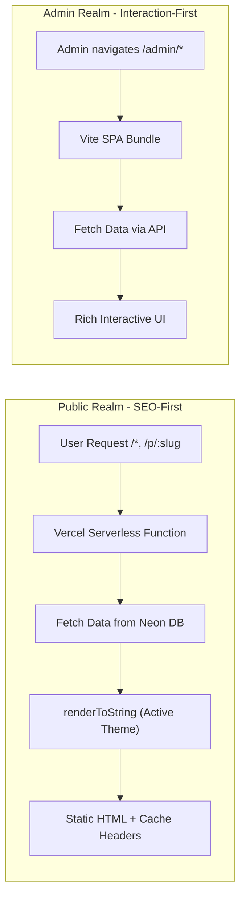

# WPVite by ATechAsync: Master Plan

| | |
|---|---|
| **Project Name** | WPVite |
| **Created By** | ATechAsync |
| **Goal** | Create a lightweight, serverless CMS with a React/Vite architecture that mimics the WordPress writing experience but offers modern performance and developer flexibility. |
| **Core Philosophy** | *"Admin is an App (SPA), Public is a Document (SSR/SEO)."* |

---

## 1. High-Level Architecture

The system utilizes a **Hybrid Rendering Strategy** hosted on Vercel.

### A. The "Dual-Realm" Concept



| Realm | URL | Technology | Behavior | Outcome |
|---|---|---|---|---|
| **Public** (SEO-First) | `/*` (Root, Posts, Pages) | Vercel Serverless Function (Node.js) + React SSR | Requests intercepted by serverless function → fetch data from Neon → render active Theme to HTML string → serve with aggressive caching (`stale-while-revalidate`) | Perfect SEO, Open Graph support, no hydration delay |
| **Admin** (Interaction-First) | `/admin/*` | Standard Vite SPA | Loads lightweight JS bundle → fetches data via API | Instant transitions, rich UI state, "App-like" feel |

---

## 2. Technology Stack

### Core & Infrastructure

| Component | Technology |
|---|---|
| **Runtime** | Node.js (Vercel Serverless Functions) |
| **Bundler** | Vite (with `vite-plugin-ssr` or manual SSR config) |
| **Language** | TypeScript |
| **Database** | Neon (Serverless PostgreSQL) |
| **ORM** | Drizzle ORM (Lightweight, type-safe, low cold-start) |
| **Storage** | Vercel Blob (for uploads) & External URLs |

### Frontend (Admin & Editor)

| Component | Technology |
|---|---|
| **UI Framework** | React 18+ |
| **Styling** | Tailwind CSS (Utility-first) |
| **Editor** | BlockNote (TipTap/Prosemirror based) — customized to mimic WordPress Gutenberg/Classic hybrid feel |
| **State/Data Fetching** | TanStack Query (React Query) v5 |
| **Routing** | React Router DOM v6 |

### Authentication

| Component | Technology |
|---|---|
| **Provider** | Google OAuth 2.0 |
| **Strategy** | "Invite Only / Allowlist" |
| **First Run** | First email to log in becomes **Super Admin** |
| **Subsequent** | Only emails explicitly added to `users` table can log in |
| **Session** | JWT stored in `HttpOnly` Secure Cookies |

---

## 3. Database Schema (Drizzle)

### `users`

| Column | Type | Notes |
|---|---|---|
| `id` | `UUID` | Primary Key |
| `email` | `VARCHAR` | Unique, Indexed |
| `google_id` | `VARCHAR` | |
| `role` | `ENUM` | `'super_admin'`, `'editor'`, `'author'` |
| `name` | `VARCHAR` | |
| `avatar_url` | `VARCHAR` | |

### `posts`

| Column | Type | Notes |
|---|---|---|
| `id` | `UUID` | Primary Key |
| `slug` | `VARCHAR` | Unique, Indexed |
| `title` | `VARCHAR` | |
| `content` | `JSON` | BlockNote structured content |
| `excerpt` | `TEXT` | |
| `status` | `ENUM` | `'published'`, `'draft'`, `'private'` |
| `featured_image` | `VARCHAR` | URL |
| `allow_comments` | `BOOLEAN` | Default: `true` |
| `author_id` | `UUID` | FK → `users.id` |
| `created_at` | `TIMESTAMP` | |
| `updated_at` | `TIMESTAMP` | |

### `media`

| Column | Type | Notes |
|---|---|---|
| `id` | `UUID` | Primary Key |
| `url` | `VARCHAR` | Vercel Blob or External |
| `type` | `VARCHAR` | MIME type |
| `alt_text` | `VARCHAR` | |
| `uploaded_at` | `TIMESTAMP` | |

### `options`

| Column | Type | Notes |
|---|---|---|
| `key` | `VARCHAR` | **PK** — e.g. `'site_title'`, `'active_theme'`, `'comment_config'` |
| `value` | `TEXT` | |

---

## 4. Feature Specifications

### A. The "WordPress-like" Editor

- **UI:** Clean canvas
- **Toolbar:** Fixed top bar (Classic style) + Slash commands (`/`)
- **Media Integration:**
  - Clicking "Image" opens the **Media Manager Modal**
  - **Tab 1 (Library):** Grid view of `media` table
  - **Tab 2 (Upload / External URL):** Drag & Drop to Vercel Blob OR Direct hotlinking input

### B. Theme System (Code-Based)

- **Location:** `src/themes/`
- **Structure:** Each theme is a folder containing React components (`Layout.tsx`, `Post.tsx`)
- **Logic:** The SSR Function reads the `active_theme` from the DB and dynamically imports the correct components to render the HTML
- **Development:** Follows [`THEME.md`](file:///d:/WPVite/Plan/THEME.md) guidelines

### C. Comments System

- **Strategy:** External Service Integration (No local DB storage for comments)
- **Settings:** Configurable via Admin Dashboard → Settings
- **Enable/Disable:** Global toggle and per-post override
- **Provider:** Selectable between **Giscus** (GitHub Discussions) or **Disqus**
- **Configuration:**

  | Key | Type |
  |---|---|
  | `comment_provider` | `'giscus'` \| `'disqus'` \| `'none'` |
  | `disqus_shortname` | `String` |
  | `giscus_repo` | `String` (and associated config) |

### D. PWA (Progressive Web App)

- **Manifest:** Generated dynamically based on Site Settings (Logo, Title)
- **Service Worker:**
  - Cache generic assets (CSS/JS)
  - Offline fallback page for Public views

---

## 5. Development Phases

> [!TIP]
> Each phase has its own detailed plan document. See `Phase-*-Plan.md` files.

| Phase | Name | Key Deliverables |
|---|---|---|
| **1** | [Foundation & Infrastructure](file:///d:/WPVite/Plan/Phase-1-Plan.md) | Vite + TS setup, Vercel + Neon, Drizzle ORM, DB connectivity test |
| **2** | [Authentication & Setup Wizard](file:///d:/WPVite/Plan/Phase-2-Plan.md) | Google OAuth, `/setup` route, JWT/Cookie, Admin Layout Shell |
| **3** | [The Content Engine (Admin)](file:///d:/WPVite/Plan/Phase-3-Plan.md) | Media Manager, BlockNote Editor, Post CRUD, Settings Page |
| **4** | [The Public Renderer (SSR)](file:///d:/WPVite/Plan/Phase-4-Plan.md) | SSR Entry Point, `renderToString`, Default Theme, SEO, Comments |
| **5** | [Optimization & PWA](file:///d:/WPVite/Plan/Phase-5-Plan.md) | Caching, PWA, UI Polish, Theme documentation |

---

## 6. Directory Structure

```
/
├── api/                  # Vercel Serverless Functions
│   ├── index.ts          # Public SSR Handler
│   ├── auth/             # OAuth Endpoints
│   └── trpc/             # (Optional) or REST API for Admin
├── src/
│   ├── admin/            # Admin SPA Code
│   │   ├── components/   # Editor, MediaManager
│   │   └── pages/        # Dashboard, PostList, Settings
│   ├── themes/           # Public Themes
│   │   └── default/      # Default Theme Components
│   ├── db/               # Drizzle Schema & Config
│   ├── lib/              # Utilities (Auth, API Clients)
│   └── entry-client.tsx  # Vite Client Entry
├── drizzle/              # Migrations
├── public/               # Static Assets
├── vercel.json           # Vercel Config (Rewrites/Headers)
└── vite.config.ts        # Vite Config
```
